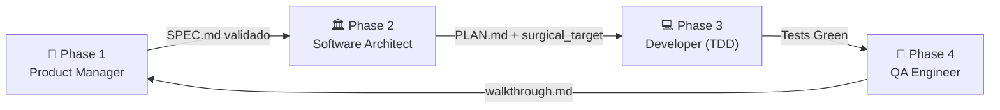

# ATUAL.md — Estado Atual da Infraestrutura Antigravity + BMAD Harness

> **Data de Geração**: 2026-06-28  
> **Gerado por**: Antigravity AI Agent (Claude Opus 4.6)  
> **Workspace**: `c:\AG PROJETOS\BmadHarness`  
> **Propósito**: Documento vivo que consolida TUDO sobre a infraestrutura do Antigravity, configurações globais, skills, regras, workflows, organização do Graphify, orquestração multi-agente e o projeto BmadHarness — que está sendo construído como a futura atualização do motor Antigravity.

---

## Sumário

1. [Visão Geral da Arquitetura](#1-visão-geral-da-arquitetura)
2. [Diretórios e Caminhos Críticos](#2-diretórios-e-caminhos-críticos)
3. [Configurações Globais do Agente](#3-configurações-globais-do-agente)
4. [Sistema de Skills (Habilidades)](#4-sistema-de-skills-habilidades)
5. [Regras e Governança (Rules)](#5-regras-e-governança-rules)
6. [Workflow BMAD: Persona Shift Loop](#6-workflow-bmad-persona-shift-loop)
7. [Projeto BmadHarness: Estrutura Completa](#7-projeto-bmadharness-estrutura-completa)
8. [Graphify: Mapeamento Estrutural](#8-graphify-mapeamento-estrutural)
9. [Orquestração Multi-Agente (@blade-ai/boss-skill)](#9-orquestração-multi-agente-blade-aiboss-skill)
10. [TDD Gate e Telemetria de Estado](#10-tdd-gate-e-telemetria-de-estado)
11. [Knowledge Items (KI) System](#11-knowledge-items-ki-system)
12. [Regra Bilíngue e Convenções](#12-regra-bilíngue-e-convenções)
13. [Histórico de Decisões e Contexto](#13-histórico-de-decisões-e-contexto)

---

## 1. Visão Geral da Arquitetura

O **Antigravity** é um AI Coding Agent operando sob o framework **BMAD** (Breakthrough Method for Agile AI-Driven Development). Sua arquitetura é um sistema híbrido de camadas:

```
┌─────────────────────────────────────────────────────────────┐
│                   CAMADA GLOBAL (User-Wide)                  │
│  C:\Users\lgbon\.gemini\config\                              │
│  ├── GEMINI.md        ← Regras cognitivas globais            │
│  ├── AGENTS.md        ← (Não existe globalmente)             │
│  ├── skills/          ← ag_master_index + science + plugins  │
│  └── plugins/         ← android, chrome, firebase, science   │
├─────────────────────────────────────────────────────────────┤
│                CAMADA DE SKILLS OFFLINE                       │
│  C:\AG SKILLS\                                               │
│  ├── ag_master_index/ ← Catálogo Mestre de Indexação         │
│  ├── bmad-core-methodology/                                  │
│  ├── andrej-karpathy/                                        │
│  ├── grill-and-evolve/                                       │
│  └── ... (2000+ skills categorizadas)                        │
├─────────────────────────────────────────────────────────────┤
│             CAMADA LOCAL (Project-Scoped)                     │
│  c:\AG PROJETOS\BmadHarness\                                 │
│  ├── AGENTS.md        ← Regras de workspace (Graphify + Boss)│
│  ├── GEMINI.md        ← Karpathy-Harness Protocol (local)    │
│  ├── CLAUDE.md        ← Instruções de agente (herança)       │
│  ├── .agents/          ← Skills locais + state + bin + rules  │
│  └── graphify-out/    ← Grafo de dependências do código      │
└─────────────────────────────────────────────────────────────┘
```

### Raciocínio por trás desta arquitetura

A separação em 3 camadas garante:
- **Isolamento**: Regras globais nunca poluem projetos específicos e vice-versa.
- **Herança**: Cada camada local pode herdar e sobrescrever regras globais.
- **Economia de tokens**: Carregamento JIT (Just-In-Time) de skills conforme necessidade.

---

## 2. Diretórios e Caminhos Críticos

### Mapa completo de diretórios relevantes:

```
# ═══════════════════════════════════════════════════════════════
# GLOBAIS (aplicam-se a TODOS os projetos)
# ═══════════════════════════════════════════════════════════════

C:\Users\lgbon\.gemini\config\
├── GEMINI.md                    # Regras cognitivas globais do agente
├── skills\
│   └── ag_master_index\
│       └── SKILL.md             # Catálogo Mestre de Skills Offline
└── plugins\
    ├── android-cli-plugin\      # Plugin CLI Android
    ├── chrome-devtools-plugin\  # Plugin DevTools Chrome
    ├── firebase\                # Plugin Firebase
    ├── flutter\                 # Plugin Flutter
    ├── google-antigravity-sdk\  # SDK do Antigravity
    ├── modern-web-guidance-plugin\ # Guias Web Modernos
    └── science\                 # 40+ skills científicas (AlphaFold, PubMed, etc.)

C:\AG SKILLS\                    # Vault centralizado de skills offline
├── AG_MEGA_CATALOGO.md          # Catálogo mega (~362KB) de todas as skills
├── README.md                    # Índice de skills offline (~57KB)
├── ag_master_index\             # Ponto de entrada JIT
├── bmad-core-methodology\       # Metodologia BMAD central
├── andrej-karpathy\             # Princípios Karpathy
├── grill-and-evolve\            # Auditoria de exceções + Viabilidade
└── ... (2000+ diretórios de skills)

# ═══════════════════════════════════════════════════════════════
# LOCAIS (específicos do BmadHarness)
# ═══════════════════════════════════════════════════════════════

c:\AG PROJETOS\BmadHarness\
├── .agent\                      # Framework de agente local
│   ├── state.json               # Telemetria de estado do sprint
│   ├── bin\
│   │   ├── state-manager.js     # CLI para manipular state.json
│   │   └── tdd-gate.js          # Gate de validação TDD pre-commit
│   ├── rules\
│   │   ├── pm_rules.md          # Regras do Product Manager
│   │   ├── architect_rules.md   # Regras do Arquiteto
│   │   ├── developer_rules.md   # Regras do Desenvolvedor (TDD)
│   │   └── qa_rules.md          # Regras do QA Engineer
│   ├── skills\
│   │   ├── grill-and-evolve\    # Skill customizada de auditoria
│   │   │   ├── SKILL.md         # Manifesto da skill
│   │   │   ├── scripts\
│   │   │   │   └── analyze_project_metrics.py  # Script Python de validação
│   │   │   └── examples\
│   │   │       └── golden_case_refactoring.py  # Exemplo Karpathy vs Bloated
│   │   └── harness_dynamic_index\
│   │       └── SKILL.md         # Índice de Domínio Local
│   └── templates\
│       ├── SPEC.md              # Template de especificação
│       └── PLAN.md              # Template de plano técnico
├── 00_docs\
│   ├── README.md                # Descrição da organização de docs
│   ├── SPEC.md                  # Especificação funcional (EN-US)
│   ├── PLAN.md                  # Plano arquitetural + ADRs (EN-US)
│   └── walkthrough.md           # Relatório de entrega (PT-BR)
├── src\
│   └── passwordValidator.js     # Código-fonte de produção
├── tests\
│   ├── passwordValidator.test.js      # Testes do validador de senhas
│   └── analyze_project_metrics.test.js # Testes de integração da skill
├── graphify-out\
│   ├── graph.json               # Grafo estrutural (~82KB)
│   ├── graph.html               # Visualização interativa (~98KB)
│   ├── GRAPH_REPORT.md          # Relatório de comunidades e hubs
│   ├── manifest.json            # Manifesto de arquivos rastreados
│   └── .graphify_labels.json    # Labels das comunidades
├── AGENTS.md                    # Regras do workspace (Graphify + Boss)
├── GEMINI.md                    # Karpathy-Harness Protocol
├── CLAUDE.md                    # Instruções de agente (herança global)
├── prompt.md                    # Meta-prompt de auto-análise híbrida
├── package.json                 # Config Node.js (Jest, scripts)
└── .gitignore                   # Exclusões de versionamento
```

> **Semântica**: O agente sempre começa pela camada global (regras injetadas automaticamente), depois carrega a camada local (`.agents/`, `AGENTS.md`), e por último faz loading cirúrgico de skills conforme a tarefa.

---

## 3. Configurações Globais do Agente

### 3.1 GEMINI.md Global (Regras Cognitivas)

O arquivo `GEMINI.md` na raiz `C:\Users\lgbon\.gemini\config\` contém as instruções cognitivas injetadas em TODA conversa. É composto por regras XML aninhadas:

```xml
<!-- Estrutura do arquivo global de regras -->
<RULE[bmad_core]>
  <!-- 7 regras fundamentais do BMAD -->
</RULE[bmad_core]>

<RULE[bmad_skills_centralization]>
  <!-- Regra de centralização de skills em C:\AG SKILLS\ -->
</RULE[bmad_skills_centralization]>

<RULE[bmad_jit_skills_protocol]>
  <!-- Protocolo JIT de carregamento de skills -->
</RULE[bmad_jit_skills_protocol]>
```

#### As 7 Regras Fundamentais do `bmad_core`:

| # | Regra | Descrição | Exemplo de Aplicação |
|---|-------|-----------|---------------------|
| 1 | **Supremacy of Documentation** | Fonte de verdade = documentação do projeto, não chat | Antes de editar código, ler `SPEC.md` e `PLAN.md` |
| 2 | **Bilingual Rule** | PT-BR para chat e planos; EN-US para código e specs | `implementation_plan.md` em PT-BR, `SPEC.md` em EN-US |
| 3 | **Privacy & Security** | Jamais expor API keys, senhas no chat | Segredos em `.env` dentro de `.gitignore` |
| 4 | **Methodological Phases** | 4 fases (PM → Architect → Dev → QA) | Não misturar planejamento com código no mesmo passo |
| 5 | **Human-in-the-Loop** | Parar e perguntar em pivôs arquiteturais | Nunca auto-gerar respostas pelo usuário |
| 6 | **Elicitation & Critical Thinking** | Red Team vs Blue Team em arquiteturas | Stress-test de lógica antes de finalizar planos |
| 7 | **Anti-Hallucination Math** | Cálculos financeiros DEVEM ficar em código, não no chat | Fórmulas de Bazin/Graham em funções Python puras |

### 3.2 GEMINI.md Local (Karpathy-Harness Protocol)

O GEMINI.md na raiz do projeto BmadHarness adiciona regras locais:

```markdown
# Arquivo: c:\AG PROJETOS\BmadHarness\GEMINI.md

## 1. Andrej Karpathy's Core Coding Principles
- Think Before Coding: Escrever 2 linhas de raciocínio antes de editar
- Simplicity First: Mínimo de código necessário
- Surgical Changes: Editar SOMENTE linhas da tarefa ativa
- Goal-Driven Execution: Transformar instruções vagas em critérios concretos

## 2. Token Budget and Session Safety Gates
- Context Compaction: Solicitar novo chat ao atingir limite de tokens
- No Silent Overruns: Máximo de 10 tool steps sequenciais por turno

## 3. JIT-Skills Activation
- Cognitive Diagnosis: Verificar ag_master_index no início de tarefas complexas
- Surgical Selection: Carregar SOMENTE skills necessárias
- Standards Preservation: Aplicar skills como padrões inegociáveis

## 4. Strict 3-Step Auto-Repair Loop
- Max 3 tentativas autônomas de reparo
- Pre-Flight Diagnostic antes de cada tentativa
- Clean Fallback: Reverter ao último commit limpo após 3 falhas
```

### 3.3 CLAUDE.md (Instruções de Agente com Herança)

O `CLAUDE.md` é o arquivo que define o contrato de herança entre global e local:

```yaml
# Frontmatter do CLAUDE.md
---
bmad_version: 2.0.0
inherits: "Global BMAD (GEMINI.md + bmad-core-methodology)"
scope: "Local Domain (BmadHarness)"
last_updated: "2026-06-16"
---
```

**Conteúdo chave:**
- Herança explícita do `GEMINI.md` global e da skill `bmad-core-methodology`
- Definição do Persona Shift Loop local (PM → Architect → Developer → QA)
- Comandos físicos/mecânicos:
  ```bash
  npm test              # Rodar suite Jest
  npm run harness:tdd   # Validar TDD gate
  npm run harness:status # Checar telemetria do state.json
  node .agents/bin/state-manager.js [args]  # Atualizar estado
  ```
- Atribuição de commits: `Co-Authored-By: Antigravity AI Agent <noreply@google.com>`

### 3.4 AGENTS.md (Regras de Workspace)

O `AGENTS.md` na raiz define 3 regras de workspace:

```markdown
## 1. Codebase Navigation via Graphify
- Map-First Querying: Inspecionar graph.json ANTES de buscar texto
- Targeted Reading: Usar relações do grafo para abrir só arquivos impactados

## 2. Multi-Agent Orchestration via @blade-ai/boss-skill
- Stateful Handoffs: Planejamento multi-agente via /boss runtime
- Dynamic Role Allocation:
  - Frontend: --roles core,ui (PM, Architect, Dev, QA, UI Designer)
  - Backend:  --roles core,devops (PM, Architect, Dev, QA, DevOps)
  - Refactoring: --roles core (Architect, Dev, QA)
- Offline Skills Integration: Agentes DEVEM consultar ag_master_index
- Audit-Ready Artifacts: Entregas em .boss/<feature_name>/

## 3. Strict Verification Gates
- Compilation check: Rodar linter antes de marcar como concluído
- No circular references: Rejeitar implementações com imports cíclicos
```

---

## 4. Sistema de Skills (Habilidades)

### 4.1 Hierarquia de Skills

O Antigravity opera com 3 níveis de skills:

```
📦 Nível 1: Skills Globais (Automáticas)
│  Localização: C:\Users\lgbon\.gemini\config\skills\
│  Descoberta: Automática pelo runtime do Antigravity
│  Exemplos: ag_master_index, science skills (40+)
│
📦 Nível 2: Skills Offline Centralizadas
│  Localização: C:\AG SKILLS\
│  Descoberta: Via consulta JIT ao ag_master_index
│  Tamanho: 2000+ skills (~362KB no catálogo)
│  Regra: TODA skill offline deve residir aqui
│
📦 Nível 3: Skills Locais (Project-Scoped)
│  Localização: .agents/skills/ de cada workspace
│  Descoberta: Via harness_dynamic_index local
│  Exemplos: grill-and-evolve, harness_dynamic_index
│  Regra: Residem ESTRITAMENTE locais ao projeto
```

### 4.2 Protocolo JIT-Skills (Just-In-Time)

O fluxo cognitivo de carregamento de skills em cada tarefa:

```python
# Pseudocódigo do Protocolo JIT-Skills
def jit_skills_protocol(task):
    # 1. Diagnóstico Cognitivo
    task_type = analyze(task)  # arch, dev, test, refactor, db?
    
    # 2. Consulta ao Catálogo
    index = read("C:\\AG SKILLS\\ag_master_index\\SKILL.md")
    local_index = read(".agents/skills/harness_dynamic_index/SKILL.md")
    
    # 3. Seleção Cirúrgica
    skills = match(task_type, index + local_index)
    
    # 4. Carregamento Offline
    for skill in skills:
        manifest = read(f"C:\\AG SKILLS\\{skill.name}\\SKILL.md")
        apply_as_standards(manifest)
    
    # 5. Transparência
    notify_user(f"Skills carregadas: {[s.name for s in skills]}")
```

### 4.3 Estrutura de uma Skill

Toda skill segue a estrutura:

```
skill-name/
├── SKILL.md            # Obrigatório: Frontmatter YAML + instruções Markdown
├── scripts/            # Opcional: Scripts auxiliares
├── examples/           # Opcional: Implementações de referência
├── resources/          # Opcional: Assets e templates
└── references/         # Opcional: Documentação adicional
```

**Exemplo real — Frontmatter do `grill-and-evolve/SKILL.md`:**

```yaml
---
name: grill-and-evolve
description: "Custom skill to perform static audits of exception handling 
in Python codebases, calculate strategic niche viability metrics, and apply 
Karpathy's software design simplicity guidelines using Socratic questioning 
and refinement loops (/grill-me)."
always_on: false
---
```

### 4.4 Índice de Domínio Local (harness_dynamic_index)

O `harness_dynamic_index` é o ponto de entrada local que mapeia as skills do projeto:

```markdown
# Separação de Responsabilidades (SoC):
# - Skills LOCAIS: Validações, regras, scripts do BmadHarness
# - Skills GLOBAIS: Frameworks, design guidelines, metodologias BMAD

# Regra para o agente:
# Se precisa de design guidelines ou frameworks → ag_master_index (global)
# Se precisa de auditorias e métricas do Harness → aqui (local)
```

### 4.5 Skills Científicas (Plugin Science)

O plugin `science` expõe 40+ skills para bioinformática e pesquisa científica:

```
Bancos de dados: AlphaFold, ChEMBL, ClinVar, dbSNP, Ensembl, gnomAD, 
                 GTEx, InterPro, JASPAR, OpenTargets, PDB, PubChem, 
                 PubMed, Reactome, STRING, UniProt, etc.
                 
Ferramentas:     Foldseek (busca 3D), MSA (alinhamento), BLAST/MMseqs2 
                 (homologia), PyMOL (visualização), AlphaGenome

Literatura:      arXiv, bioRxiv, Europe PMC, OpenAlex
```

---

## 5. Regras e Governança (Rules)

### 5.1 Regras de Persona (Agent Rules)

O BmadHarness define 4 conjuntos de regras de persona em `.agents/rules/`:

#### Product Manager (PM) — `pm_rules.md`
```markdown
# Objetivo: Consolidar especificações funcionais em SPEC.md
# Regras:
1. Herdar Phase 1 do GEMINI.md global e bmad-core-methodology
2. SPEC.md DEVE ser em English (EN-US)
3. Formato declarativo: "The system must [behavior]"
4. Validação cognitiva de consistência e edge cases

# Saídas:
- 00_docs/SPEC.md (criado/atualizado)
- state.json: validation_status.gears_validated = true
- Transição automática para ARCHITECT
```

#### Software Architect — `architect_rules.md`
```markdown
# Objetivo: Projetar solução técnica e definir alvos cirúrgicos
# Regras:
1. Herdar Phase 2 do GEMINI.md global e bmad-core-methodology
2. PLAN.md e ADRs em English (EN-US)
3. Definir assinaturas de funções, tipos e fluxos de dados
4. Mapear surgical_target em state.json:
   {
     "file_path": "src/passwordValidator.js",
     "line_range_start": 1,
     "line_range_end": 45
   }

# Saídas:
- 00_docs/PLAN.md (criado/atualizado)
- state.json: surgical_target configurado
- Transição automática para DEVELOPER
```

#### Software Developer (TDD) — `developer_rules.md`
```markdown
# Objetivo: Implementar código com TDD estrito
# Regras:
1. Herdar Phase 3 do GEMINI.md global e bmad-core-methodology
2. Ciclo TDD obrigatório:
   a) Escrever/modificar teste em tests/ PRIMEIRO
   b) Executar teste e verificar FALHA (Red)
   c) Implementar solução em src/
   d) Verificar que teste PASSA (Green)
3. Gate físico tdd-gate.js valida sequência mecânica
4. Modificar ESTRITAMENTE o arquivo e range de linhas do surgical_target

# Saídas:
- tests/*.test.js (criado/atualizado)
- src/*.js (criado/atualizado)
- state.json: tdd_test_exists = true, tdd_test_executed = true
- Transição automática para QA
```

#### QA Engineer — `qa_rules.md`
```markdown
# Objetivo: Auditar entrega e validar gates físicos
# Regras:
1. Herdar Phase 4 do GEMINI.md global e bmad-core-methodology
2. Executar: npm test (suite Jest completa)
3. Executar: npm run harness:tdd (gate de validação)
4. Escrever walkthrough.md em Portuguese (PT-BR)

# Saídas:
- 00_docs/walkthrough.md (relatório técnico)
- state.json: implementation_passed = true, tdd_test_failed = false
- Apresentar fechamento do ciclo ao BOSS
```

### 5.2 Cadeia de Herança de Regras

```
┌─────────────────────────────────┐
│  GEMINI.md GLOBAL               │  ← Regras cognitivas universais
│  (C:\Users\lgbon\.gemini\config)│     (Karpathy, Anti-Hallucination, etc.)
└──────────┬──────────────────────┘
           │ herda
           ▼
┌─────────────────────────────────┐
│  bmad-core-methodology SKILL    │  ← Metodologia BMAD central
│  (C:\AG SKILLS\...)             │     (Fases, Personas, Documentação)
└──────────┬──────────────────────┘
           │ herda
           ▼
┌─────────────────────────────────┐
│  GEMINI.md LOCAL                │  ← Karpathy-Harness Protocol
│  (BmadHarness\GEMINI.md)       │     (3-Step Repair, JIT-Skills)
├─────────────────────────────────┤
│  AGENTS.md LOCAL                │  ← Regras de workspace
│  (BmadHarness\AGENTS.md)       │     (Graphify, Boss, Verification)
├─────────────────────────────────┤
│  CLAUDE.md LOCAL                │  ← Contrato de herança explícito
│  (BmadHarness\CLAUDE.md)       │     (Persona Loop, Comandos)
└──────────┬──────────────────────┘
           │ especializa
           ▼
┌─────────────────────────────────┐
│  .agents/rules/*.md              │  ← Regras por persona
│  (pm, architect, developer, qa) │     (Comportamento específico por fase)
└─────────────────────────────────┘
```

---

## 6. Workflow BMAD: Persona Shift Loop

### 6.1 Ciclo Completo de Desenvolvimento

O BMAD opera em 4 fases sequenciais obrigatórias:



### 6.2 Transições de Estado

As transições são controladas por `state.json`:

```jsonc
// .agents/state.json — Estado atual do sprint
{
  "current_sprint_id": "sprint-001",
  "active_task_id": "task-0002",
  "active_persona": "QA",           // PM | ARCHITECT | DEVELOPER | QA
  "surgical_target": {
    "file_path": "src/passwordValidator.js",
    "line_range_start": 1,
    "line_range_end": 45
  },
  "validation_status": {
    "gears_validated": true,         // PM validou SPEC
    "tdd_test_exists": true,         // Teste existe
    "tdd_test_executed": true,       // Teste foi executado
    "tdd_test_failed": false,        // Teste não falhou (Green)
    "implementation_passed": true    // Implementação aprovada
  }
}
```

### 6.3 Comandos de Transição (CLI)

```bash
# Visualizar estado atual
node .agents/bin/state-manager.js show

# Trocar persona
node .agents/bin/state-manager.js set persona PM
node .agents/bin/state-manager.js set persona ARCHITECT
node .agents/bin/state-manager.js set persona DEVELOPER
node .agents/bin/state-manager.js set persona QA

# Definir alvo cirúrgico (arquivo + range de linhas)
node .agents/bin/state-manager.js set target src/passwordValidator.js 1 45

# Atualizar flags de validação
node .agents/bin/state-manager.js set validation tdd_test_executed true
node .agents/bin/state-manager.js set validation tdd_test_failed false
node .agents/bin/state-manager.js set validation implementation_passed true
```

### 6.4 Exemplo Concreto de Ciclo Completo

```
1. PM lê requisitos → cria 00_docs/SPEC.md em EN-US
   state: { active_persona: "PM", gears_validated: true }

2. ARCHITECT traduz em PLAN.md → define ADRs e surgical_target
   state: { active_persona: "ARCHITECT", surgical_target: { file_path: "src/foo.js", ... } }

3. DEVELOPER escreve test PRIMEIRO → verifica falha → implementa → verifica sucesso
   state: { active_persona: "DEVELOPER", tdd_test_exists: true, tdd_test_executed: true }

4. QA roda `npm test` → roda `npm run harness:tdd` → escreve walkthrough.md em PT-BR
   state: { active_persona: "QA", implementation_passed: true, tdd_test_failed: false }
```

---

## 7. Projeto BmadHarness: Estrutura Completa

### 7.1 Identidade do Projeto

```json
// package.json
{
  "name": "bmad-harness-workspace",
  "version": "1.0.0",
  "description": "Ambiente de Desenvolvimento Core do BMAD Harness",
  "scripts": {
    "test": "jest",
    "harness:tdd": "node .agents/bin/tdd-gate.js",
    "harness:status": "node .agents/bin/state-manager.js"
  },
  "devDependencies": {
    "jest": "^29.7.0"
  }
}
```

### 7.2 Código de Produção

#### `src/passwordValidator.js` — Validador de Senhas

```javascript
// Valida senha contra regras de segurança
// Retorna { isValid: boolean, errors: string[] }

function validatePassword(password) {
  const errors = [];
  const safePassword = password || '';

  // REQ-001: Mínimo 8 caracteres
  if (safePassword.length < 8) errors.push('REQ-001');

  // REQ-002: Pelo menos uma letra maiúscula (A-Z)
  if (!/[A-Z]/.test(safePassword)) errors.push('REQ-002');

  // REQ-003: Pelo menos uma letra minúscula (a-z)
  if (!/[a-z]/.test(safePassword)) errors.push('REQ-003');

  // REQ-004: Pelo menos um dígito numérico (0-9)
  if (!/[0-9]/.test(safePassword)) errors.push('REQ-004');

  // REQ-005: Pelo menos um caractere especial
  const specialCharRegex = /[\!@#\$%\^\&\*\(\)_\+\-\=\[\]\{\}\|;\':\",.\/\<\>\?]/;
  if (!specialCharRegex.test(safePassword)) errors.push('REQ-005');

  return { isValid: errors.length === 0, errors };
}

module.exports = { validatePassword };
```

**Contexto**: Este código é o "campo de provas" (proving ground) do BmadHarness. Ele foi escolhido como a primeira implementação para validar que toda a cadeia de TDD, state management, e verification gates funciona end-to-end.

### 7.3 Suite de Testes

#### `tests/passwordValidator.test.js` — Testes Unitários (6 testes)

```javascript
// 6 cenários de teste cobrindo todos os REQs:
// 1. Falha com < 8 caracteres → REQ-001
// 2. Falha sem maiúscula → REQ-002
// 3. Falha sem minúscula → REQ-003
// 4. Falha sem dígito → REQ-004
// 5. Falha sem caractere especial → REQ-005
// 6. Sucesso quando todas as regras satisfeitas
```

#### `tests/analyze_project_metrics.test.js` — Testes de Integração (3 testes)

```javascript
// Testa o script Python analyze_project_metrics.py via execSync:
// 1. Exit code 2 quando Vn < 3.0 (rejeição estratégica)
// 2. Exit code != 0 quando CL ou AC são zero (ValueError)
// 3. Exit code 0 quando Vn >= 3.0 e sem violações
//
// Detalhe: Auto-detecta Python em .venv/ ou sistema global
```

### 7.4 Skill Customizada: grill-and-evolve

#### Funcionalidades:

**1. Cálculo de Viabilidade de Nicho ($V_n$)**
```python
# Fórmula: Vn = (US * PM) / (CL * AC)
# Onde:
#   US = Potential Users (Scale)
#   PM = Estimated Profit Margin
#   CL = Customer Acquisition Cost (CAC)
#   AC = Cost of Servicing
#
# Restrições:
#   - Se CL ou AC <= 0 → ValueError
#   - Se Vn < 3.0 → Exit code 2 (rejeição estratégica)
```

**2. Auditoria Estática de Exceções Silenciadas**
```python
# Varre recursivamente arquivos .py procurando:
#   except:        + pass/continue nas próximas 2 linhas ativas
#   except Exception: + pass/continue nas próximas 2 linhas ativas
#
# Exclui diretórios: node_modules, .git, .agents, .agent, venv, .venv, __pycache__
# Se violações encontradas → Exit code 1
```

**3. Loop Socrático `/grill-me`**
```markdown
# Ativado pelo comando /grill-me
# O agente entrevista o usuário socraticamente sobre decisões de design:
# - "Por que você está introduzindo esta nova classe?"
# - "Esta dependência é realmente necessária?"
# - "Existe uma forma mais simples de fazer isto?"
```

### 7.5 Referência de Refatoração (Golden Case)

O arquivo `golden_case_refactoring.py` demonstra a filosofia Karpathy com exemplos lado a lado:

```python
# ❌ BLOATED & DEFENSIVE (Anti-Pattern)
def process_user_data_bloated(raw_data):
    try:
        user_id = raw_data['id']
        age = int(raw_data['age'])
    except Exception:
        pass  # VIOLAÇÃO: Silenciamento genérico

# ✅ KARPATHY CLEAN & TDD-READY
def process_user_data_clean(raw_data):
    if 'id' not in raw_data or 'age' not in raw_data:
        raise ValueError("Invalid user structure: 'id' and 'age' are required.")
    try:
        age = int(raw_data['age'])
    except (ValueError, TypeError) as e:
        raise ValueError(f"Invalid age type: {raw_data['age']}") from e
    # ... lógica limpa sem silenciamento
```

### 7.6 Meta-Prompt de Auto-Análise (prompt.md)

O `prompt.md` é o prompt de instrução para que o agente execute uma auto-análise do sistema híbrido em 5 estágios:

```
STAGE 1: METRIC & ARCHITECTURAL DISCOVERY
→ Analisar sandbox, localizar CLIs, skills, configurações

STAGE 2: ARCHITECTURAL SELF-CRITIQUE & MERGE SPECIFICATION
→ Produzir Conflict & Complement Matrix
→ Avaliar limitações técnicas do setup dual
→ Formular estratégia de integração

STAGE 3: SELF-DIRECTED MERGE IMPLEMENTATION
→ Executar merge arquitetural
→ Refatorar configs e metadata

STAGE 4: PRODUCTION MODIFICATION
→ Implementar modificações cirurgicamente
→ Rodar pipeline de validação completo

STAGE 5: POST-MORTEM & VERSION CONTROL
→ Commit atômico e descritivo
→ Relatório final detalhado
```

### 7.7 Templates de Documentação

#### Template SPEC.md (Especificação)
```markdown
# Specification: [Feature Name]
## 🎯 Product Goals
## 📜 Functional Requirements
  - **REQ-001**: The system must [behavior]...
## 🧪 Acceptance Criteria
  - [ ] Criterion 1...
```

#### Template PLAN.md (Plano Técnico)
```markdown
# Plano Técnico & ADRs: [Nome da Funcionalidade]
## 🛠️ Detalhes da Solução
## 📂 Alvos Cirúrgicos (Surgical Targets)
  - **[NEW|MODIFY]** `src/[filename].js` (Linhas X a Y)
## 🏛️ Registros de Decisão Arquitetural (ADRs)
  ### ADR-001: [Título da Decisão]
```

---

## 8. Graphify: Mapeamento Estrutural

### 8.1 O que é o Graphify

O Graphify é uma ferramenta de análise estrutural que gera um grafo de dependências do código-fonte. Ele produz:

- **`graph.json`** (~82KB): Grafo completo com 129 nós e 116 arestas
- **`graph.html`** (~98KB): Visualização interativa no browser
- **`GRAPH_REPORT.md`**: Relatório legível com comunidades e hubs
- **`manifest.json`**: Manifesto de arquivos rastreados com hashes AST

### 8.2 Métricas Atuais do Grafo

```
Corpus: 24 arquivos · ~6,094 palavras
Nós:    129
Arestas: 116
Comunidades: 22 (18 significativas, 4 finas)
Extração: 100% EXTRACTED · 0% INFERRED
Commit base: 2207ba38
```

### 8.3 God Nodes (Abstrações Centrais)

| Rank | Nó | Arestas |
|------|-----|---------|
| 1 | Agent Instructions - BMAD Harness | 6 |
| 2 | main() | 4 |
| 3 | run_codebase_audit() | 4 |
| 4 | scripts (package.json) | 4 |
| 5-8 | Execution Guidelines (4 personas) | 4 cada |
| 9 | Skill: grill-and-evolve | 4 |

### 8.4 Comunidades Relevantes

| Community | Coesão | Conteúdo |
|-----------|--------|----------|
| 0 | 0.18 | Package.json: scripts, deps, metadata |
| 1 | 0.20 | PLAN.md: ADRs, surgical targets, solution design |
| 2 | 0.36 | state-manager.js: fs, path, read/write state |
| 3 | 0.36 | analyze_project_metrics.py: viability + audit |
| 4-6 | 0.29 | CLAUDE.md: governance, inheritance, persona loop |
| 7 | 0.29 | Golden case: clean vs bloated refactoring |
| 8 | 0.29 | SKILL.md: Karpathy philosophy, /grill-me |
| 10 | 0.40 | SPEC.md: product goals, functional reqs |
| 11 | 0.40 | walkthrough.md: checklist, artefatos entregues |
| 12-15 | 0.40 | Persona rules: PM, Architect, Developer, QA |

### 8.5 Comandos do Graphify

```bash
# Construir/atualizar o grafo (sem custo de API)
graphify update .

# Consultar nós isolados ou relações
graphify query

# Verificar se o grafo está atualizado
git rev-parse HEAD  # Comparar com commit no GRAPH_REPORT.md
```

### 8.6 Regra Map-First Querying

```
❌ PROIBIDO: grep -r "algumTexto" --include="*.js" .
✅ CORRETO:  
   1. Ler graphify-out/graph.json
   2. Identificar nós e comunidades relevantes
   3. Abrir SOMENTE os arquivos impactados pela tarefa
```

---

## 9. Orquestração Multi-Agente (@blade-ai/boss-skill)

### 9.1 Conceito do /boss Runtime

O `/boss` é o runtime de orquestração multi-agente que coordena as 4 personas do BMAD. Ele:

- Executa **Stateful Handoffs** entre personas
- Faz **Dynamic Role Allocation** baseado no tipo de tarefa
- Persiste artefatos em `.boss/<feature_name>/`
- Integra com o **ag_master_index** para carregamento de skills

### 9.2 Alocação Dinâmica de Roles

```bash
# Frontend (UI modifications)
/boss --roles core,ui
# Personas: PM, Architect, Developer, QA, UI Designer

# Backend (database/infrastructure)
/boss --roles core,devops
# Personas: PM, Architect, Developer, QA, DevOps

# Refactoring/Bug fixes (simples)
/boss --roles core
# Personas: Architect, Developer, QA
```

### 9.3 Fluxo de Integração com Skills

```
/boss recebe tarefa
  ↓
Cada agente (persona) no runtime DEVE:
  1. Consultar ag_master_index (global)
     Caminho: C:\Users\lgbon\.gemini\config\skills\ag_master_index\SKILL.md
     Ou:      C:\AG SKILLS\ag_master_index\SKILL.md
  
  2. Consultar harness_dynamic_index (local)
     Caminho: .agents/skills/harness_dynamic_index/SKILL.md
  
  3. Carregar SKILL.md correspondente à tarefa ativa
  
  4. Aplicar instruções da skill como padrões inegociáveis
  ↓
Somente DEPOIS o agente pode escrever código ou arquitetura
```

---

## 10. TDD Gate e Telemetria de Estado

### 10.1 TDD Gate (`tdd-gate.js`)

O TDD Gate é um validador pre-commit que impede commits sem testes correspondentes:

```javascript
// Lógica de validação:
// 1. Lista arquivos staged com `git diff --cached`
// 2. Filtra arquivos de produção (src/, lib/, app/)
// 3. Para cada arquivo de produção:
//    a. Busca teste correspondente: *.test.js ou *.spec.js
//    b. Verifica se o teste está staged OU já tracked no Git
//    c. Se não encontrar → ❌ TDD Gate Violation (exit 1)
// 4. Verifica compliance do state.json:
//    a. Se persona é DEVELOPER ou QA:
//       - tdd_test_executed DEVE ser true
//       - tdd_test_failed DEVE ser false
//       - implementation_passed DEVE ser true
```

### 10.2 State Manager (`state-manager.js`)

Utilitário CLI para manipular o estado do sprint:

```javascript
// Operações suportadas:
// show               → Exibe state.json formatado
// set persona [X]    → Altera persona ativa (PM|ARCHITECT|DEVELOPER|QA)
// set target [path start end] → Define alvo cirúrgico
// set validation [key] [bool] → Altera flag de validação

// Validações:
// - Persona deve ser uma das 4 permitidas
// - Linhas devem ser inteiros positivos
// - Key de validação deve existir no schema
```

### 10.3 Fluxo de Validação Mecânica

```
Desenvolvedor escreve código
        ↓
npm test (Jest)
        ↓ (se verde)
npm run harness:tdd (tdd-gate.js)
        ↓ verifica:
        ├── Arquivo de teste existe para cada arquivo de produção?
        ├── state.json validation_status está completo?
        └── Sem violações de estado?
        ↓ (se aprovado)
git commit  ✅
```

---

## 11. Knowledge Items (KI) System

### 11.1 Estrutura do Sistema de Conhecimento

Os Knowledge Items são snapshots curados de contexto específico de cada repositório:

```
C:\Users\lgbon\.gemini\antigravity-ide\knowledge\
└── 02_BMAD_DOCS_COGNITIVE_MAP\
    ├── metadata.json       # Sumário, timestamps, referências
    └── artifacts\
        └── cognitive_map.md # Mapa cognitivo de documentação
```

### 11.2 Cognitive Map (BMAD Documentation)

O KI `02_BMAD_DOCS_COGNITIVE_MAP` contém um mapa de roteamento de documentação do projeto Aevum Oikos (projeto irmão do BmadHarness):

```
TASK RECEIVED →
  1. Check cognitive map for relevant domains
  2. If domain matches ADR table → view_file the specific ADR
  3. If task involves new feature scope → view_file the PRD
  4. If task involves architecture/data → view_file the Tech Spec
  5. If task involves future/production → view_file the Backlog
  6. If none match → proceed with bmad-core rules only
```

**Custo de tokens**: ~250 linhas carregadas automaticamente + 16-46 linhas por documento individual.

---

## 12. Regra Bilíngue e Convenções

### 12.1 Tabela de Idiomas por Recurso

| Recurso | Idioma | Exemplo |
|---------|--------|---------|
| Chat com o usuário | PT-BR | "Vou implementar a validação..." |
| implementation_plan.md | PT-BR | "## Mudanças Propostas" |
| walkthrough.md | PT-BR | "## Checklist de Verificação" |
| Código-fonte | EN-US | `function validatePassword()` |
| Variáveis | EN-US | `const safePassword = ...` |
| Comentários no código | EN-US | `// REQ-001: Minimum length` |
| SPEC.md | EN-US | `"The system must..."` |
| PLAN.md | EN-US | `"## Solution Design"` |
| SKILL.md (frontmatter) | EN-US | `name: grill-and-evolve` |
| AGENTS.md / GEMINI.md | EN-US | `## Strict Verification Gates` |
| Git commits | EN-US | `feat: add password validation` |

### 12.2 Convenções de Commit

```
Co-Authored-By: Antigravity AI Agent <noreply@google.com>
```

### 12.3 Convenções de Segurança

```
# .gitignore — NUNCA versionados
node_modules/
.env
.env.*
.playground/
tmp/
coverage/
*.log
.venv/
venv/
```

---

## 13. Histórico de Decisões e Contexto

### 13.1 Cronologia de Atualizações de Contexto

| Data | Evento | Impacto |
|------|--------|---------|
| 2026-06-16 | Criação do BmadHarness | Workspace inaugural do framework BMAD |
| 2026-06-16 | Implementação do passwordValidator | Primeiro código TDD completo |
| 2026-06-16 | Criação do state-manager.js e tdd-gate.js | Infraestrutura de telemetria e gates |
| 2026-06-16 | Definição das 4 regras de persona | PM, Architect, Developer, QA |
| 2026-06-16 | Configuração do Graphify | Grafo de dependências com 129 nós |
| 2026-06-16 | Definição do CLAUDE.md com herança | Contrato formal de herança global→local |
| 2026-06-16 | Criação da skill grill-and-evolve | Auditoria Python + Viabilidade de Nicho |
| 2026-06-16 | Integração do harness_dynamic_index | Índice de domínio local com SoC |
| 2026-06-16 | Criação do walkthrough.md | Relatório QA com prova de 9/9 testes |
| 2026-06-28 | Atualização do prompt.md | Meta-prompt de auto-análise híbrida |
| 2026-06-28 | Atualização do Graphify | Graph report reconstruído (commit 2207ba38) |

### 13.2 ADRs do Projeto

**ADR-001: Python 3 Standard Scripting**
- **Contexto**: Scripts de validação precisam scanear arquivos e computar métricas
- **Decisão**: Python 3 puro sem dependências externas (os, sys, json, argparse)
- **Prós**: Alta portabilidade, sem requirements.txt
- **Contras**: Parsing implementado com stdlib

**ADR-002: Jest Integration Testing**
- **Contexto**: Garantir que o script Python responde com exit codes corretos
- **Decisão**: Jest (Node.js) executando o Python via `execSync` e validando saídas
- **Prós**: Integrado ao pipeline Jest existente, verificação TDD automática
- **Contras**: Depende de Python 3 disponível no PATH de testes

### 13.3 O BmadHarness como Futuro do Antigravity

O BmadHarness não é um projeto qualquer — ele está sendo construído como o **campo de testes e a futura atualização do motor Antigravity**. Seu propósito:

1. **Validar a metodologia BMAD end-to-end**: Provar que o ciclo PM→Architect→Developer→QA funciona mecanicamente com gates físicos.

2. **Prototipar o sistema de orquestração multi-agente**: O framework `/boss` com alocação dinâmica de roles será o futuro do Antigravity quando operar em tarefas complexas.

3. **Estabelecer o padrão de skills locais vs globais**: A separação `harness_dynamic_index` (local) vs `ag_master_index` (global) é o blueprint para todos os projetos futuros.

4. **Criar o modelo de auto-análise**: O `prompt.md` com suas 5 fases de meta-cognição é o protótipo do "self-awareness loop" que o Antigravity usará para se auto-diagnosticar e evoluir.

5. **Provar o paradigma Karpathy**: A integração das regras de simplicidade do Karpathy no ciclo TDD demonstra que é possível ter velocidade e qualidade sem complexidade desnecessária.

---

> **Nota Final**: Este documento deve ser tratado como **living documentation** — deve ser atualizado sempre que houver mudanças significativas na infraestrutura, skills, regras ou workflows do Antigravity. A data no topo indica a última atualização verificada.

---
*Co-Authored-By: Antigravity AI Agent <noreply@google.com>*
