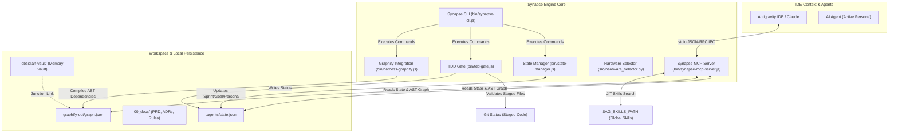

# ⚡ Synapse Engine V2

**Synapse Engine** is a high-performance Node.js command-line interface (CLI) and native Model Context Protocol (MCP) server engineered for AI-assisted development orchestration. It implements local automation harnesses, governance grounded in the **BMAD (Breakthrough Method for Agile AI-Driven Development)** framework, critical token reduction via Context Sharding with **Graphify AST**, and persistent memory management based on the **Obsidian Zettelkasten Vault**.

---

## 🏛️ Architecture & Communication Flow

The diagram below illustrates the data flow between the LLM (IDE), Synapse MCP Server, local CLI, Git, and local persistence layer:



---

## 🔑 Key Technical Pillars

### 1. AST Dependency Graph (Graphify AST Integration)
Synapse Engine integrates with **Graphify** topological mapping to expose Abstract Syntax Trees (AST) surgically to LLMs.
*   **Problem:** Loading massive graph files directly into the LLM context window consumes thousands of tokens and causes attention dilution.
*   **Solution:** The native MCP server exposes specialized tools (`query_graph`, `shortest_path`, `get_node`) that incrementally query the graph stored at `graphify-out/graph.json`. Instead of blindly reading files or conducting exhaustive text searches, the LLM navigates direct code dependencies using a fraction of tokens.

### 2. Persistent Memory (Obsidian Zettelkasten Vault)
To preserve context alignment across multiple development sessions, Synapse adopts the Zettelkasten architecture within `.obsidian-vault/`:
*   `permanent/`: Permanent technical notes and business domain specifications. Read by the agent before proposing major architectural refactorings (Pre-flight Architectural Read).
*   `chats/`: Atomic post-task summaries detailing implemented solutions, design choices, and test results (Session Serialization).
*   **Junction Link:** The `synapse init` command automatically creates a physical Windows Directory Junction linking `.obsidian-vault/graphify-links` to `graphify-out`, enabling Obsidian to natively inspect and index Graphify reports.
*   **Synchronization (`npm run harness:sync-memory`):** Executes the PowerShell automation script (`scripts/sync-memory.ps1`) to refresh AST graphs, verify junction link health, and audit YAML Frontmatter formatting across vault notes.

---

## 🛠️ Available CLI Commands

| Command | Description | Syntax / Example |
| :--- | :--- | :--- |
| **`init`** | Initializes the Harness in the workspace, injects `.agents/`, local rules, and creates the Obsidian Junction Link. | `synapse init` |
| **`update`** | Updates local Harness components from the master template while preserving `state.json`. | `synapse update` |
| **`setup --global`** | Configures global IDE governance in the user directory and registers the global skills path. | `synapse setup --global` |
| **`doctor`** | Executes full environment autodiagnostics (Graphify, MCP Server, State, Vault, AST Graph). | `synapse doctor` |
| **`status`** | Queries or updates local Harness state (Sprint, Active Persona, Surgical Target). | `synapse status show`<br>`synapse status set persona DEVELOPER` |
| **`tdd`** | TDD Validation Gate: Ensures staged Git files have passing unit tests and updates state telemetry. | `synapse tdd` |
| **`mcp`** | Starts stdio JSON-RPC MCP server or runs token/latency benchmark suite. | `synapse mcp start`<br>`synapse mcp benchmark` |
| **`hardware`** | Evaluates hardware acceleration options (DirectML/CUDA vs CPU) for neural inference tasks. | `synapse hardware --check` |
| **`graphify`** | Incrementally updates the local AST dependency graph. | `synapse graphify` |

---

## 📦 Project Structure & Modules

The Synapse Engine repository is structured modularly:

```
├── .agents/
│   ├── rules/                 # Injected workspace rules (graphify.md, synapse-core.md, etc.)
│   ├── skills/                # Workspace-exclusive skills
│   └── state.json             # Active telemetry (Sprint, Persona, Surgical Target)
├── 00_docs/                   # Semantic taxonomy (PRD, Tech Specs, ADRs, Rules)
├── bin/
│   ├── synapse-cli.js         # Main CLI entrypoint (Commander.js)
│   ├── synapse-mcp-server.js  # Stdio JSON-RPC MCP Server
│   ├── github-mcp-server.exe  # Stdio MCP Server for GitHub API integration
│   ├── state-manager.js       # Utility script managing state.json
│   ├── tdd-gate.js            # Quality validator for tests and staged Git files
│   ├── hardware-selector.js   # Node.js wrapper for Python hardware selector
│   └── harness-graphify.js    # Interface for Graphify trigger and audit
├── src/
│   ├── synapse_forge.py       # Directory scaffolding, ADR templates (MADR 4.0.0), and Graphify initializer
│   └── hardware_selector.py   # GPU (CUDA, DirectML) vs CPU logical router based on latency and payload
├── tests/                     # Automated test suites (Jest for JS, PyTest for Python)
│   ├── synapse_mcp_benchmark.test.js  # MCP latency and token consumption benchmarks
│   ├── hardware_selector.test.py       # Complete Python hardware selector test suite
│   └── synapse_cli.test.js            # CLI integration tests
├── scripts/
│   ├── release.js             # Unified test, versioning, tag, and GitHub release pipeline
│   └── sync-memory.ps1        # Obsidian Vault and Graphify synchronizer script
```

---

## 🚀 Installation & Configuration

Install Synapse Engine globally from GitHub:

```bash
npm install -g git+https://github.com/LuGuBo/Synapse-Engine.git
```

### Portability & Environment Variable `AG_SKILLS_PATH`
To avoid hardcoded absolute paths across multiple machines or user accounts, the CLI and MCP Server dynamically resolve the central Global Skills Vault location following this priority:

1. System environment variable: **`AG_SKILLS_PATH`**
2. Windows Fallback: `C:\ag-skills`
3. Unix/macOS Fallback: `~/ag-skills`

To configure on Windows (PowerShell):
```powershell
[System.Environment]::SetEnvironmentVariable("AG_SKILLS_PATH", "D:\YourPath\ag-skills", "User")
```

---

## 📈 Token Savings Benchmark (Native MCP Server)

The stdio JSON-RPC MCP server (`bin/synapse-mcp-server.js`) eliminates token overhead in agent interactions:

| Approach | Payload Size | Estimated Tokens | IPC Latency | Context Efficiency |
| :--- | :--- | :--- | :--- | :--- |
| **Direct Read (`graph.json` Dump)** | `234.26 KB` | ~59,970 tokens | Disk I/O | **Baseline (0%)** |
| **Synapse Graphify MCP Server** | **`0.23 KB`** | **~58 tokens** | **`0.810 ms`** | **🔥 99.90% Reduction (1,034x savings)** |

---

## 🚀 Automated Release Pipeline

Synapse Engine includes an automated release pipeline executed via:
```bash
npm run release
```
This script (`scripts/release.js`):
1. Runs local unit test suites (`jest`) as a quality gate.
2. Creates the build commit (`chore(release): prepare release vX.Y.Z`).
3. Publishes the local tag and commits to origin on GitHub.
4. Generates the release entry on GitHub via REST API using the **`GITHUB_PAT`** token from `.env`.

