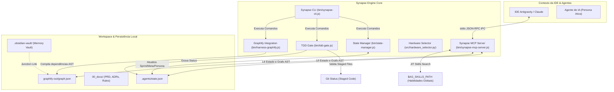

# ⚡ Synapse Engine V2

**Synapse Engine** é um framework de linha de comando (CLI) em Node.js de alta performance projetado para orquestração de desenvolvimento assistido por IA. Ele implementa o Harness de automação local, governança baseada na metodologia **BMAD (Breakthrough Method for Agile AI-Driven Development)**, redução crítica de tokens através de Context Sharding com **Graphify AST**, e persistência de memória contínua baseada no **Obsidian Zettelkasten Vault**.

---

## 🏛️ Diagrama de Arquitetura e Comunicação

O diagrama abaixo ilustra o fluxo de dados entre o LLM (IDE), o Servidor MCP do Synapse, a CLI local, o Git e a estrutura de persistência local:



---

## 🔑 Fundamentos Técnicos Principais

### 1. Grafo de Dependências AST (Graphify AST Integration)
O Synapse Engine integra-se ao mapeamento topológico **Graphify** para expor a árvore de sintaxe abstrata (AST) do projeto de forma cirúrgica para o LLM. 
*   **Problema:** Carregar arquivos de grafo gigantescos no contexto do LLM consome milhares de tokens e gera ruído.
*   **Solução:** O servidor MCP nativo expõe ferramentas (`query_graph`, `shortest_path`, `get_node`) que consultam incrementalmente o grafo estruturado em `graphify-out/graph.json`. Em vez do LLM ler arquivos cegamente ou realizar buscas extensivas, ele navega pelas dependências diretas de código usando apenas frações de tokens.

### 2. Memória Persistente (Obsidian Zettelkasten Vault)
Para manter o alinhamento contextual em múltiplas sessões de desenvolvimento, o Synapse adota a arquitetura de Zettelkasten em `.obsidian-vault/`:
*   `permanent/`: Notas técnicas permanentes e especificações de negócios do projeto. Lidas pelo agente antes de propor grandes mudanças arquiteturais (Pre-flight Architectural Read).
*   `chats/`: Resumos atômicos pós-tarefa que detalham as soluções aplicadas, decisões de design e testes executados (Session Serialization).
*   **Junction Link:** O comando `synapse init` cria automaticamente uma junção física de diretórios no Windows (Directory Junction) vinculando `.obsidian-vault/graphify-links` a `graphify-out`, permitindo que o Obsidian leia de forma nativa e indexe os relatórios gerados pelo Graphify.
*   **Sincronização (`npm run harness:sync-memory`):** Roda o script de automação em PowerShell (`scripts/sync-memory.ps1`) para atualizar o grafo AST, verificar a integridade do link de junção e auditar a formatação do Frontmatter YAML das notas Markdown no vault Obsidian para evitar erros de sintaxe.

---

## 🛠️ Comandos Disponíveis da CLI

| Comando | Descrição | Sintaxe / Exemplo |
| :--- | :--- | :--- |
| **`init`** | Inicializa o Harness no repositório, injeta a pasta `.agents/`, regras locais e cria o Junction Link com o Obsidian. | `synapse init` |
| **`update`** | Atualiza os componentes do Harness a partir do repositório mestre, preservando `state.json`. | `synapse update` |
| **`setup --global`** | Configura a governança global da IDE na pasta do usuário e registra o diretório de skills globais. | `synapse setup --global` |
| **`status`** | Consulta ou atualiza o estado local do Harness (Sprint, Persona Ativa, Meta Cirúrgica). | `synapse status show`<br>`synapse status set persona DEVELOPER` |
| **`tdd`** | Portão de validação TDD: Garante que os arquivos staged no Git possuem testes válidos e atualiza o status de validação. | `synapse tdd` |
| **`mcp`** | Inicia o servidor Stdio JSON-RPC ou roda benchmarks de latência e consumo de tokens. | `synapse mcp start`<br>`synapse mcp benchmark` |
| **`hardware`** | Diagnóstico dinâmico e seleção de aceleração de hardware (DirectML/CUDA) para inferência neuronal. | `synapse hardware --check` |
| **`graphify`** | Atualiza incrementalmente o gráfico de dependências AST local. | `synapse graphify` |

---

## 📦 Estrutura do Projeto & Módulos Técnicos

O repositório do Synapse Engine está estruturado de forma desacoplada e portátil:

```
├── .agents/
│   ├── rules/                 # Regras locais injetadas (graphify.md, synapse-core.md, etc.)
│   ├── skills/                # Habilidades exclusivas do projeto local
│   └── state.json             # Telemetria ativa (Sprint, Persona, Alvo Cirúrgico)
├── 00_docs/                   # Taxonomia semântica (PRD, Tech Specs, ADRs, Rules)
├── bin/
│   ├── synapse-cli.js         # Ponto de entrada CLI (utiliza commander.js)
│   ├── synapse-mcp-server.js  # Servidor stdio JSON-RPC MCP
│   ├── state-manager.js       # Script utilitário para manipulação do state.json
│   ├── tdd-gate.js            # Validador de qualidade de testes e arquivos staged no git
│   ├── hardware-selector.js   # Interface Node.js para o seletor de hardware em Python
│   └── harness-graphify.js    # Interface para gatilho e auditoria incremental do Graphify
├── src/
│   ├── synapse_forge.py       # Scaffolding de diretórios, templates ADR (MADR 4.0.0) e inicializador Graphify
│   └── hardware_selector.py   # Seletor lógico de GPU (CUDA, DirectML) vs CPU baseado em latência e payload
├── scripts/
│   ├── release.js             # Pipeline unificado de testes, versionamento, tag e release no GitHub
│   └── sync-memory.ps1        # Sincronizador e validador do Obsidian Vault e Graphify
```

---

## 🚀 Como Instalar e Configurar

Instale o Synapse Engine de forma global a partir do repositório GitHub:

```bash
npm install -g git+https://github.com/LuGuBo/Synapse-Engine.git
```

### Portabilidade e Variável de Ambiente `AG_SKILLS_PATH`
Para evitar caminhos absolutos hardcoded em setups de múltiplas máquinas ou ambientes multiusuários, a CLI e o Servidor MCP resolvem dinamicamente a localização do repositório centralizado de habilidades globais (*Global Skills Vault*) seguindo a ordem de prioridade:

1.  Caminho definido na variável de ambiente do sistema: **`AG_SKILLS_PATH`**
2.  Fallback Windows: `C:\AG SKILLS`
3.  Fallback Unix/macOS: `~/ag-skills`

Para configurar em seu ambiente Windows (Powershell):
```powershell
[System.Environment]::SetEnvironmentVariable("AG_SKILLS_PATH", "D:\SeuCaminho\AG SKILLS", "User")
```

---

## 📈 Benchmark de Economia de Tokens (Servidor MCP Nativo)

O servidor stdio JSON-RPC MCP (`bin/synapse-mcp-server.js`) elimina a sobrecarga de tokens nas interações do agente:

| Abordagem | Tamanho do Payload | Tokens Estimados | Latência IPC | Eficiência de Contexto |
| :--- | :--- | :--- | :--- | :--- |
| **Leitura Direta (Dump do `graph.json`)** | `234.26 KB` | ~59.970 tokens | E/S de Disco | **Baseline (0%)** |
| **Synapse Graphify MCP Server** | **`0.23 KB`** | **~58 tokens** | **`0.810 ms`** | **🔥 99.90% Redução (1034x mais econômico)** |

---

## 🚀 Script de Release Automatizado

O Synapse Engine inclui um pipeline de publicação executável através do comando:
```bash
npm run release
```
Este script (`scripts/release.js`):
1.  Roda a suíte de testes locais (`jest`) como portão de qualidade.
2.  Cria o commit residual de build (`chore(release): prepare release vX.Y.Z`).
3.  Gera e envia a tag local e os commits para o repositório origin remoto no GitHub.
4.  Cria a Release visual no GitHub através da API REST utilizando o token configurado na variável **`GITHUB_PAT`** do arquivo `.env` local.
